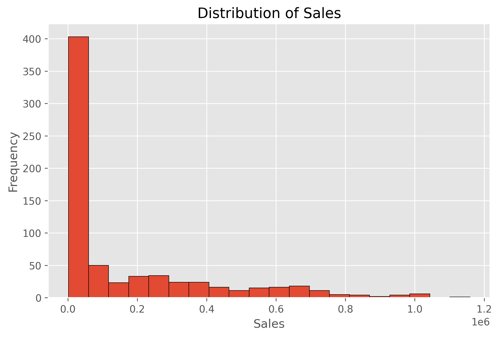
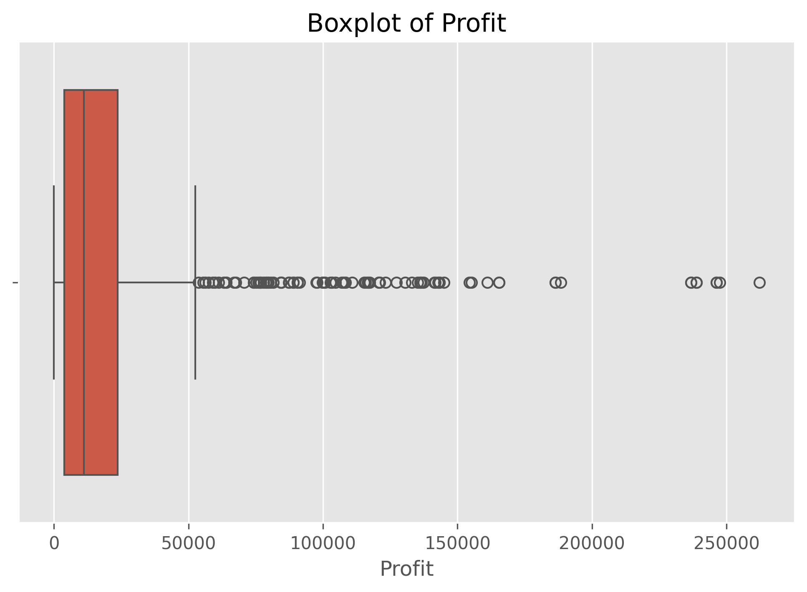
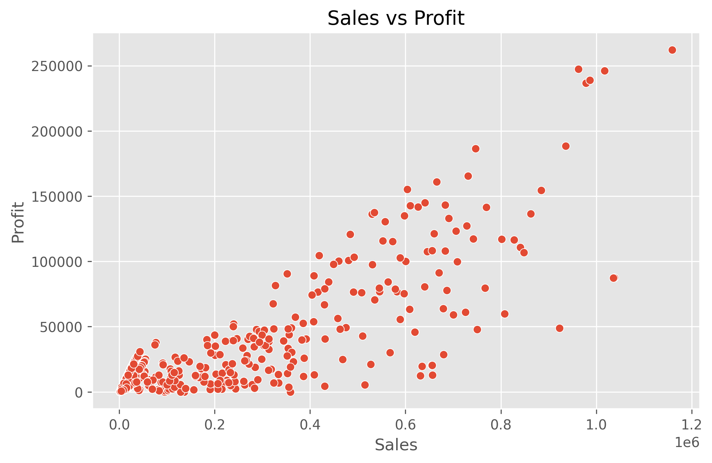
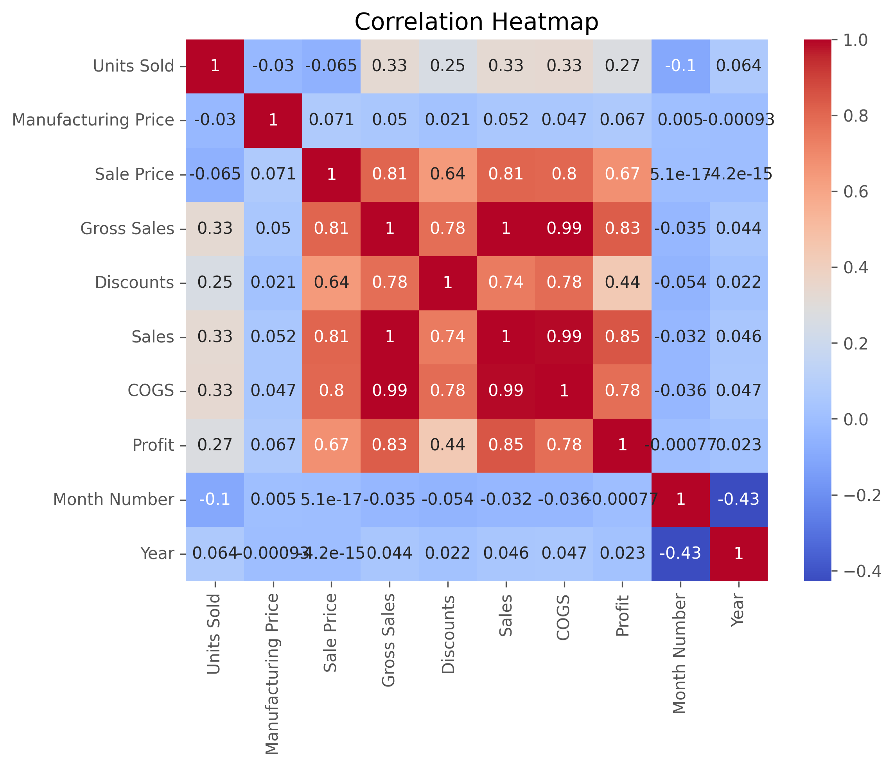
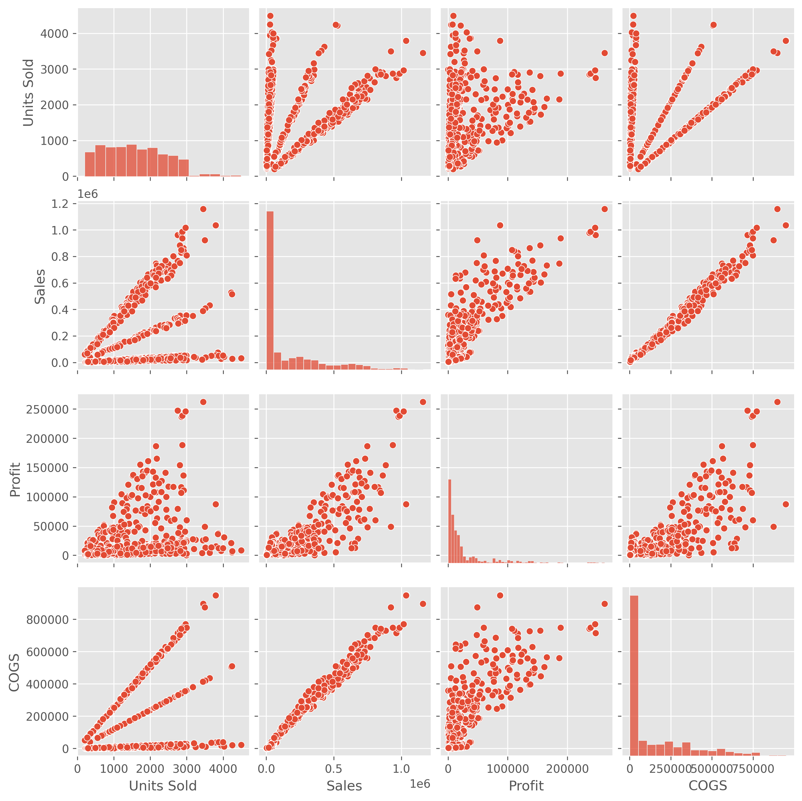

# Exploratory Data Analysis (EDA)

## Objective
Perform Exploratory Data Analysis (EDA) on the Financial Sales dataset using Python to identify trends, relationships, and patterns.

## Tools Used
- Python
- Pandas
- Matplotlib
- Seaborn
- Jupyter Notebook

## Dataset
Financial Sales Dataset

## Analysis Performed
- Dataset Overview
- Missing Value Check
- Summary Statistics
- Value Counts
- Histogram
- Boxplot
- Scatter Plot
- Correlation Heatmap
- Pairplot

## Results

### Histogram

### Boxplot

### Scatter Plot

### Heatmap

### Pairplot

## Summary
- Dataset contains 700 records and 16 columns.
- No missing values were found.
- Sales are right-skewed.
- Profit contains outliers.
- Sales and Profit show a positive relationship.
- Gross Sales, Sales, COGS, and Profit are strongly correlated.

## Author
**Palakurthi Venkatesh Goud**